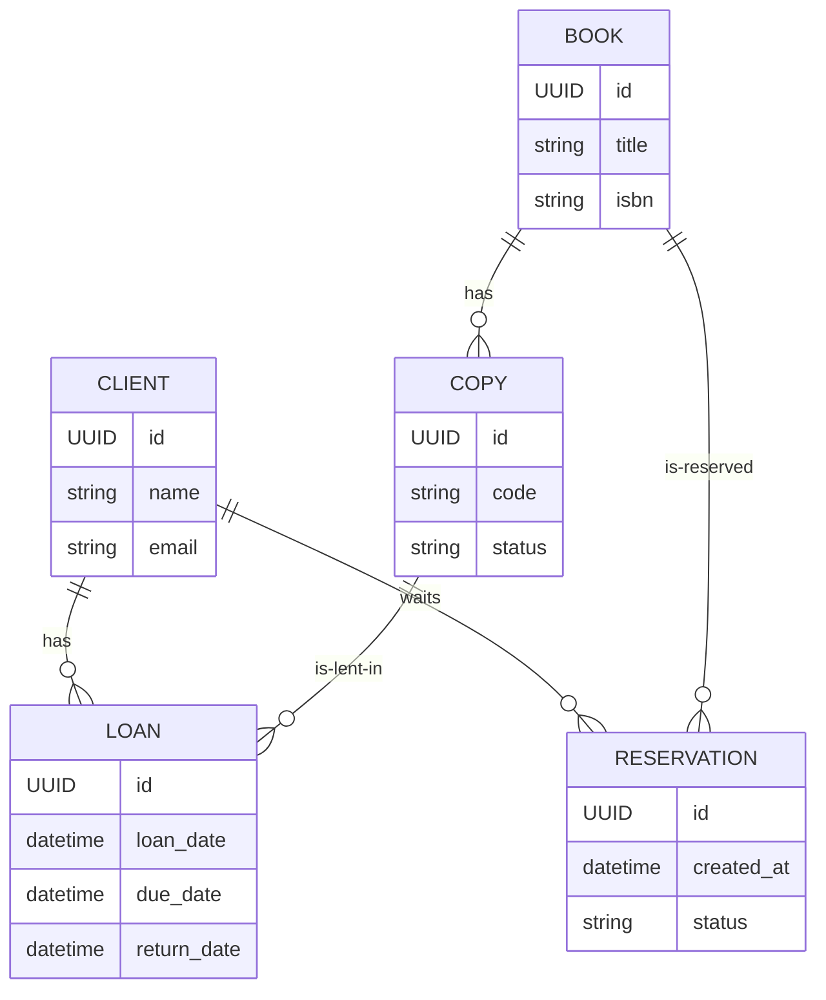
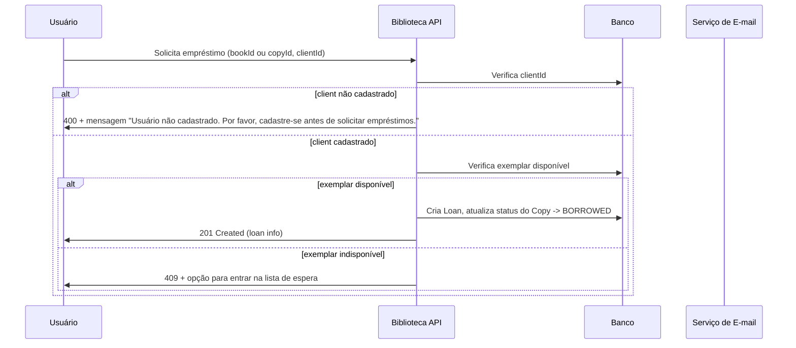
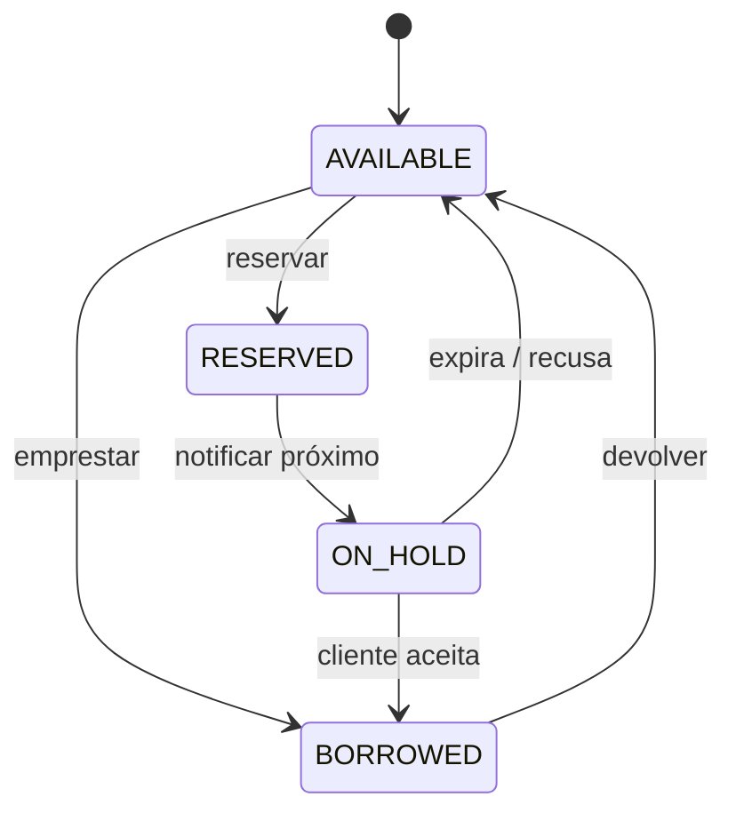

# Requisitos do Sistema — Biblioteca Express

**Autor:** Gepeto (ChatGPT)<br>
**Revisor:** Rodrigo Silvério<br>
**Repositório base:** [https://github.com/silverioTenor/challenge-02--library_express](https://github.com/silverioTenor/challenge-02--library_express)<br>
**Data:** 21/09/2025

---

## 1. Objetivo

Documento de requisitos funcionais e não funcionais para o sistema *Biblioteca Express*, cobrindo:

* Gestão de clientes
* Gestão de livros
* Gestão de empréstimos (incluindo reservas, lista de espera e notificações por e‑mail)

O documento inclui: modelo de dados, APIs REST propostas, diagramas (ERD, sequências), critérios de aceitação e notas de implementação leves (pensadas para rodar em ambientes com recursos limitados).

> **Observação / Assunções**
>
> * Usei o repositório indicado como referência de contexto e estrutura geral. Caso precise que eu reproduza literalmente mensagens/strings presentes em arquivos do repositório, posso extrair depois — por ora o documento segue as regras de negócio que você descreveu e padrões REST/Spring Boot comuns.
> * Optei por designs simples e sem dependências pesadas (sem Kafka, sem filas externas complexas) para manter compatibilidade com ambientes/free tiers.

---

## 2. Visão Geral do Fluxo de Empréstimo

1. Usuário solicita empréstimo de um livro.
2. Sistema valida se usuário está cadastrado.

    * Se **não cadastrado**: exibe mensagem informando a necessidade de cadastro (mensagem amigável e com link/rota para cadastro).
3. Sistema valida disponibilidade do exemplar:

    * Se **disponível**: realiza empréstimo (gera registro `Loan`) e altera estado do exemplar para `BORROWED`.
    * Se **emprestado** mas **reservado por outro**: oferecer opção de entrar na **lista de espera** (waitlist) para aquele livro.
    * Se **reservado** e o usuário for o reservante: permite retirar/reservar conforme regras.
4. Quando um livro é devolvido / liberado, o sistema busca a próxima pessoa na lista de espera e **envia e‑mail** notificando que o livro está disponível para retirada por um período X (ex.: 48h). Se não houver resposta ou expirar, passa para o próximo.

---

## 3. Requisitos Funcionais (RF)

### 3.1 Gestão de Clientes

RF-CL-01: Criar cliente (nome, email, documento (CPF/CNPJ opcional), telefone, endereço).

RF-CL-02: Atualizar dados de cliente.

RF-CL-03: Buscar cliente por id / por email / listar clientes (paginação).

RF-CL-04: Validar unicidade de email.

RF-CL-05: Bloquear cliente (flag) — por exemplo: inadimplência, perda de privilégios.

### 3.2 Gestão de Livros

RF-LB-01: Cadastro de livro (título, autores, isbn, edição, ano, categorias, número de cópias/itens físicos).

RF-LB-02: Atualizar livro.

RF-LB-03: Buscar por id / título / autor / isbn / listar com filtros e paginação.

RF-LB-04: Cada cópia/volume deverá ter identificador (exemplarId) e estado (AVAILABLE, BORROWED, RESERVED, MAINTENANCE).

RF-LB-05: Reservar livro (quando não disponível) — cria `Reservation` e, se necessário, lugar na fila.

### 3.3 Gestão de Empréstimos

RF-EM-01: Realizar empréstimo (criar `Loan`) considerando regras:

* Usuário deve estar cadastrado e ativo.
* Usuário não pode ter mais do que N empréstimos ativos (configurável).
* Verificar multas / pendências antes de emprestar.
* Definir data de vencimento (ex.: hoje + 14 dias).

RF-EM-02: Devolução de empréstimo — calcula multas por atraso (regra configurável), atualiza estado do exemplar, libera reserva (e aciona notificação para lista de espera).

RF-EM-03: Se o livro for reservado por outros, no momento da devolução criar uma **hold** (disponível apenas para o primeiro da fila) e enviar e‑mail.

RF-EM-04: Entrada em **lista de espera**: usuário pode optar por entrar na fila; posição é mantida por ordem cronológica; usuário não pode entrar se já estiver na fila para o mesmo livro.

RF-EM-05: Cancelamento automático de notificação se o usuário não confirmar dentro do prazo configurado.

RF-EM-06: Histórico de empréstimos por usuário.

---

## 4. Modelo de Dados (Entidades principais)

### 4.1 Entidades e atributos (resumo)

* **Client**

    * id (UUID)
    * name (string)
    * email (string, unique)
    * document (string)
    * phone (string)
    * address (string)
    * active (boolean)
    * created\_at, updated\_at

* **Book**

    * id (UUID)
    * title
    * authors (string / array)
    * isbn
    * edition
    * year
    * category
    * created\_at, updated\_at

* **Copy** (exemplar)

    * id (UUID)
    * book\_id (FK)
    * code (string) — código do exemplar
    * status (ENUM: AVAILABLE, BORROWED, RESERVED, MAINTENANCE)

* **Loan**

    * id (UUID)
    * copy\_id (FK)
    * client\_id (FK)
    * loan\_date (datetime)
    * due\_date (datetime)
    * return\_date (datetime, nullable)
    * status (ENUM: ACTIVE, RETURNED, LATE)
    * fine\_amount (decimal)

* **Reservation / WaitlistEntry**

    * id (UUID)
    * book\_id (FK)
    * client\_id (FK)
    * created\_at (datetime)
    * position (int) — opcional (calcular pela created\_at)
    * notified\_at (datetime nullable)
    * expires\_at (datetime nullable)
    * status (PENDING, NOTIFIED, ACCEPTED, EXPIRED, CANCELLED)

### 4.2 ERD (Mermaid)



---

## 5. APIs REST (propostas)

> Base path: `/api/v1`

### Clientes

* `POST /clients` — criar cliente (body: name,email,...). -> 201
* `GET /clients/{id}` — obter cliente. -> 200
* `PUT /clients/{id}` — atualizar. -> 200
* `GET /clients?email=...` — busca por email (para validação rápida).

### Livros / Exemplares

* `POST /books` — criar livro (gera automaticamente copies se informado número de cópias).
* `GET /books` — listar / filtrar.
* `GET /books/{id}` — detalhes (inclui lista de exemplares e status).
* `POST /books/{id}/copies` — adicionar exemplar.

### Empréstimos

* `POST /loans` — requisitar empréstimo. Body: { clientId, copyId } ou { clientId, bookId } (server escolhe exemplar disponível).

    * Respostas possíveis:

        * 201 (empréstimo criado)
        * 400 (usuário não cadastrado) — payload com mensagem conforme regra
        * 409 (não há exemplares disponíveis; opção para entrar na lista de espera)

* `POST /books/{bookId}/reservations` — entra na fila (body: { clientId }). -> 201

* `POST /loans/{id}/return` — marcar devolução.

* `GET /clients/{clientId}/loans` — listar empréstimos ativos/histórico.

---

## 6. Fluxos e Diagramas (Mermaid)

### 6.1 Fluxo de Empréstimo — sequência principal



### 6.2 Fluxo de Reserva / Lista de Espera + Notificação

```mermaid
sequenceDiagram
    participant C as Cliente
    participant API as Biblioteca API
    participant DB as Banco
    participant EMAIL as Serviço de E-mail

    C->>API: Pede para entrar na waitlist (bookId)
    API->>DB: Insere Reservation (status=PENDING)
    API-->>C: 201 Created (posição na fila)

    Note right of DB: Quando um exemplar é devolvido
    DB->>API: Gatilho (devolução)
    API->>DB: Busca next Reservation (status=PENDING) por created_at
    API->>DB: Marca Reservation NOTIFIED, set notified_at, expires_at = now + 48h
    API->>EMAIL: Envia aviso para cliente (com token / link de aceitação)

    alt cliente aceita (antes de expires_at)
        C->>API: Aceita reserva (clicando link)
        API->>DB: Cria Loan para aquele cliente, atualiza Copy -> BORROWED, Reservation -> ACCEPTED
    else cliente não responde (expires_at)
        API->>DB: Reservation -> EXPIRED; procura próximo na fila
        loop enquanto houver fila
            API->>DB: next Reservation
            API->>EMAIL: notifica próximo
        end
    end
```

### 6.3 Diagrama de estados (Book Copy)



---

## 7. Regras de Negócio Importantes

* RB-01: Usuário não cadastrado não pode emprestar; apresentar a mensagem conforme RF (apresentei texto padrão no fluxograma).
* RB-02: Reservas respeitam ordem cronológica.
* RB-03: Tempo de aceite da notificação configurável (sugestão padrão: 48 horas).
* RB-04: Multas por atraso configuráveis — calcular por dia útil / por dia corrido (definir no deploy).
* RB-05: Um cliente não pode entrar em fila duplicada para o mesmo livro.

---

## 8. Notificações / E‑mail

* Use `JavaMailSender` (Spring) ou serviço externo (SendGrid, Mailgun) — escolha dependendo do ambiente.
* Mensagens simples:

    * Notificação de disponibilidade: "Olá {nome}, o livro {título} está disponível. Confirme em até 48 horas no link: /reservations/{token}/accept"
    * Aviso de usuário não cadastrado: mostrar na resposta HTTP e, opcionalmente, abrir fluxo de cadastro.

---

## 9. Testes e Critérios de Aceitação

* **Caso 1 — Usuário não cadastrado solicita empréstimo**: retorna 400 com mensagem "Usuário não cadastrado...".
* **Caso 2 — Empréstimo bem-sucedido**: quando há exemplar disponível, cria loan e muda estado do copy para BORROWED.
* **Caso 3 — Entrada na lista de espera**: ao tentar emprestar com nenhum exemplar disponível, opção cria reservation e confirma posição.
* **Caso 4 — Notificação e aceite**: ao devolver, notifica primeiro da fila; se aceitar, gera loan; se não, continua.
* **Caso 5 — Expiração de hold**: após prazo, reserva expira e próximo é notificado.

Para cada caso criar testes unitários (JUnit + MockBean) e testes de integração (Spring Boot Test com banco H2 em memória).

---

## 10. Considerações de Implementação (leve)

* **Banco**: H2 (dev), Postgres (prod). Use migrations (Flyway/Liquibase).
* **E‑mail**: no free tier, configurar SMTP gratuito (ex: Gmail SMTP para testes) ou SendGrid com plano free. Enfileiramento simples: tabelas Reservation + scheduled task (ex.: `@Scheduled(fixedDelay = 5m)`) que verifica returns e processa filas.
* **Escalabilidade**: manter processamento síncrono para CRUD; usar job scheduler para notificações para reduzir latência e consumo de recursos.
* **Segurança**: autenticação básica (JWT) para endpoints administrativos e operações sensíveis.
* **Logs / Monitoring**: logs simples em console + arquivo; métricas leves com Micrometer se desejar.

---

## 11. Backlog mínimo para entrega (priorizado)

1. Modelagem BD + migrations
2. Endpoints: clientes (CRUD)
3. Endpoints: livros + exemplares
4. Empréstimo: criar loan, regras de validação
5. Reserva: entrar na fila + persistência
6. Devolução: liberar e notificar (task agendada)
7. E‑mail: integração simples e templates
8. Testes automatizados (unit + integration)

---

## 12. Anexos

### Exemplo de payload — criar empréstimo (POST /loans)

```json
{
  "clientId": "uuid-client",
  "bookId": "uuid-book"
}
```

Resposta success (201):

```json
{
  "loanId": "uuid-loan",
  "clientId": "uuid-client",
  "copyId": "uuid-copy",
  "loanDate": "2025-09-21T12:00:00Z",
  "dueDate": "2025-10-05T12:00:00Z"
}
```

### Mensagem padrão para usuário não cadastrado

> **Usuário não cadastrado.** Por favor, cadastre-se antes de solicitar empréstimos. Endpoint: `POST /clients`.

---

### Observações finais

* Se quiser, eu posso:

    * gerar automaticamente o diagrama ERD em PNG/SVG (preciso de permissão para criar arquivo no ambiente),
    * gerar endpoints `Controller`+`DTOs` esqueleto em Java (Spring Boot) com base nesse modelo,
    * extrair strings/mensagens diretamente dos arquivos do repositório se você permitir que eu acesse os arquivos (posso tentar novamente).

---

*Fim do documento.*
